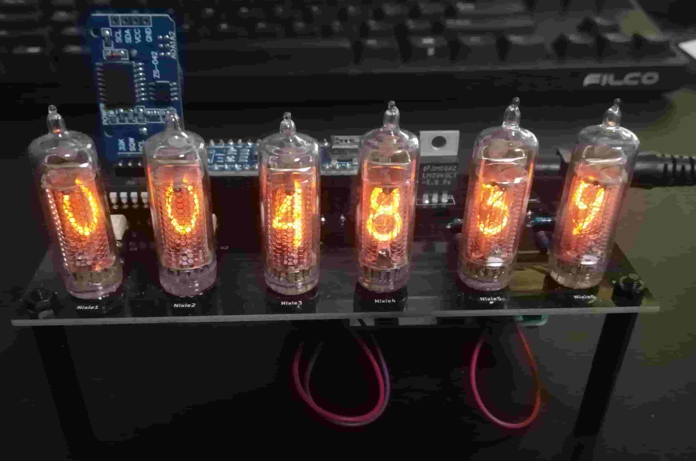

# Nixie_Tube_Clock

ニキシー管時計の制作に関するデータを載せています。

現在は試作品のデータ（ver0.1）のみで、今後改善点や機能追加をしたものを制作し公開予定です。\
※試作品はだいぶ前に制作したもので、arduinoのソースコードなどは残してなかったので載せられませんでした。次回制作するものは制作過程の情報をできる限り全て本リポジトリに公開する予定です。

## 使用部品（試作品）

* ニキシー管(IN-16) x6
* Arduino nano(互換品)
* RTC(Real Time Clock)モジュール
* フォトカプラ(TLP627)
* ニキシー管ドライバ(K155ID1)
* 三端子レギュレーター(12V→5V)
* 抵抗とかコンデンサ類（省略）
* 昇圧回路(高電圧出力昇圧DC-DCコンバータ：https://www.aitendo.com/product/6872)
* DCジャック端子(メス)

制作過程(ざっくり)：https://nogak.github.io/mypage/link/nixie_tube.html

※garbar_data以下のデータはseeed studioにてプリント基板を発注する際に用いたものです。(一部設計ミスで使えない穴があります。)

## 使用ソフトウェア
* プリント基板設計：kicad
